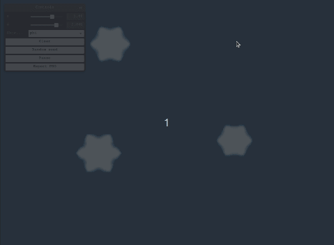

# nivis
## Simulation of ice crystal growth 



Implementation of _Ryo Kobayashi's_ dendritic crystal growth algorithm from the paper _Modeling and numerical simulations of dendritic crystal growth_.

The simulation part is written in Rust that is compiled into webassembly. Visualization and interaction is implemented in TypeScript.

A live demo is available here: TODO

## Running

```
git clone https://github.com/lvk88/nivis.git
cd www
npm i
npm run start
```

Note for windows users: in case `npm run start` complains about not being able to install wasm-pack manually, you might want to install it from this link:
https://rustwasm.github.io/wasm-pack/installer/

## Building for deployment

```
cd www
npx webpack build --mode production
```

## Tests

Currently, only the functions of the wasm module are tested.

```
cargo test
```

## References

The library is an implementation of the phase field model from:

_[1] Kobayashi, Ryo. "Modeling and numerical simulations of dendritic crystal growth." Physica D: Nonlinear Phenomena 63.3-4 (1993): 410-423._
